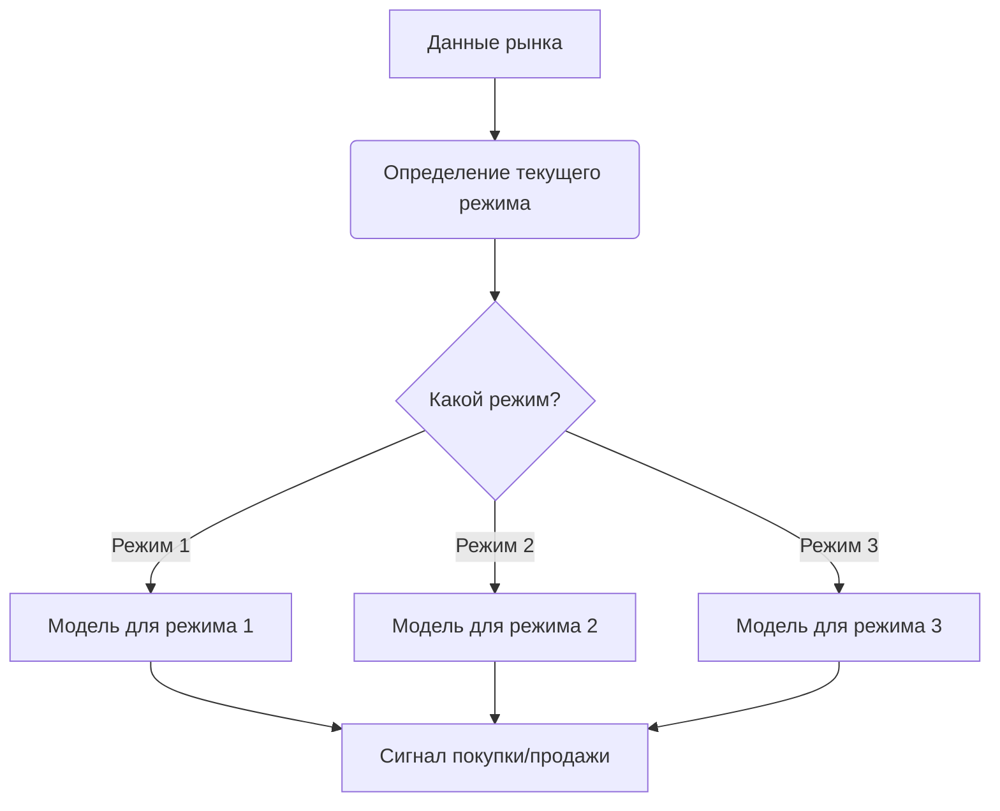

Переопределить target
В Tinkoff Invest API есть два контура - "боевой", предназначенный для исполнения ордеров на бирже и "песочница", предназначенный для тестирования API и торговых гипотез, заявки с которого не выводятся на биржу, а исполняются в эмуляторе.

Переключение между контурами реализовано через target, INVEST_GRPC_API - "боевой", INVEST_GRPC_API_SANDBOX - "песочница"

from tinkoff.invest import Client
from tinkoff.invest.constants import INVEST_GRPC_API

TOKEN = 'token'

with Client(TOKEN, target=INVEST_GRPC_API) as client:
    print(client.users.get_accounts())

    # Режимы рынка и режимное обучение (Regime-Based Training)

**Режимы рынка** — это различные состояния финансовых рынков, характеризующиеся особыми статистическими свойствами, поведением цен и корреляциями между активами. **Режимное обучение** — подход в машинном обучении, при котором алгоритмы учитывают текущий рыночный режим при прогнозировании или обучаются отдельно для каждого режима.

## 📊 Основные рыночные режимы

### 1. По направленности тренда:
- **Бычий режим**: устойчивый рост цен, позитивный настрой инвесторов
- **Медвежий режим**: устойчивое падение цен, пессимизм на рынке
- **Боковой/флетовый режим**: отсутствие четкого тренда, цены колеблются в диапазоне

### 2. По волатильности:
- **Низковолатильный режим**: спокойный рынок, небольшие дневные изменения
- **Высоковолатильный режим**: резкие движения цен, повышенные риски
- **Экстремальная волатильность**: кризисные периоды, паника на рынке

### 3. По корреляциям:
- **Высококоррелированный режим**: большинство активов движутся в одном направлении
- **Декоррелированный режим**: разнонаправленное движение различных секторов
- **Секторальный режим**: доминирование конкретных отраслей (сырьевые, банковские и т.д.)

## 🤖 Режимное обучение (Regime-Based Training)

### Суть подхода
Вместо создания единой модели для всех рыночных условий, режимное обучение предполагает:
- Выявление текущего рыночного режима
- Использование специализированной модели для каждого режима
- Или адаптацию общей модели под текущий режим

### Методы определения режимов

**1. Статистические методы:**
```python
# Пример с использованием скрытых марковских моделей (HMM)
from hmmlearn.hmm import GaussianHMM

# Обучение HMM для определения 3 режимов на основе волатильности и доходности
model = GaussianHMM(n_components=3, covariance_type="full")
model.fit(returns_and_volatility_data)
regime = model.predict(current_data)[-1]
```

**2. Индикаторы для определения режимов:**
- Скользящие средние (20, 50, 200 периодов)
- Индекс волатильности (VIX для российского рынка — RVX)
- Индексы относительной силы секторов
- Скользящая корреляция между активами

### Архитектура режимного обучения



## 💡 Практическое применение для акций IMOEX

### Шаг 1: Определите ключевые режимы для вашего рынка
Для российского рынка особенно важны:
- **Режим санкций/геополитики** — повышенная волатильность, корреляция с нефтью и рублем
- **Стабильный режим** — умеренный рост при стабильных макроэкономических показателях
- **Кризисный режим** — массовая распродажа активов
- **Режим денежного стимулирования** — рост рынка на фоне снижения ключевой ставки ЦБ РФ

### Шаг 2: Соберите признаки для определения режимов
```python
# Пример признаков для определения режимов IMOEX
features = [
    'imoex_return_5d',        # Доходность IMOEX за 5 дней
    'imoex_volatility_20d',   # Волатильность IMOEX за 20 дней
    'usdrub_change',          # Изменение курса USD/RUB
    'brent_return',           # Доходность нефти Brent
    'key_rate_change',        # Изменение ключевой ставки ЦБ РФ
    'sector_correlation',     # Средняя корреляция между секторами
    'advancing_declining_ratio' # Соотношение растущих/падающих акций
]
```

### Шаг 3: Реализуйте режимное обучение
**Вариант A: Ансамбль моделей**
```python
# Обучение отдельных моделей для каждого режима
models = {
    'stable': XGBClassifier(),
    'volatile': XGBClassifier(),
    'bearish': XGBClassifier(),
    'bullish': XGBClassifier()
}

for regime, model in models.items():
    regime_data = historical_data[historical_data['regime'] == regime]
    model.fit(regime_data[features], regime_data['target_signal'])
```

**Вариант B: Единая модель с индикатором режима**
```python
# Добавление режима как признака
data['regime_indicator_1'] = (data['regime'] == 'volatile').astype(int)
data['regime_indicator_2'] = (data['regime'] == 'bearish').astype(int)
# ... и т.д.

model = XGBClassifier()
model.fit(data[features + regime_features], data['target_signal'])
```

## 📈 Преимущества режимного обучения

1. **Повышение точности прогнозов**: Модели учитывают специфику каждого рыночного состояния
   
2. **Снижение просадок**: Адаптация стратегии к текущим условиям позволяет избежать крупных убытков в неблагоприятных режимах

3. **Стабильность результатов**: Снижение дисперсии доходности по сравнению с универсальными моделями

4. **Интерпретируемость**: Проще понять, почему модель выдает те или иные сигналы в конкретных рыночных условиях

## ⚠️ Вызовы и риски

- **Запаздывание определения режима**: Режим часто можно точно определить только постфактум
- **Краткосрочные режимы**: Некоторые режимы длятся слишком мало для адаптации модели
- **Переобучение**: Риск создания слишком большого количества специализированных моделей
- **Смещение данных**: Неравномерное распределение данных по режимам (кризисные периоды встречаются реже)

## 💡 Рекомендации для вашего проекта с акциями IMOEX

1. **Начните с 3-4 базовых режимов**: стабильный рост, умеренная волатильность, высокая волатильность, кризис

2. **Используйте мультисрочные признаки**:
   - Краткосрочные (1-5 дней) для определения текущего состояния
   - Среднесрочные (20-60 дней) для контекста
   - Долгосрочные (>100 дней) для макротрендов

3. **Примените блендинг моделей**:
   ```python
   # Взвешенная комбинация прогнозов моделей разных режимов
   weights = calculate_regime_confidence(current_data)
   final_signal = sum(weights[regime] * models[regime].predict(current_data) 
                     for regime in regimes)
   ```

4. **Внедрите защиту от ложных срабатываний**:
   - Требуйте подтверждения режима в течение нескольких дней
   - Используйте консервативные сигналы в переходные периоды
   - Добавьте фильтры по объемам и волатильности

Режимное обучение особенно эффективно для российского рынка из-за его высокой чувствительности к внешним факторам и периодов резких изменений условий. Это подход позволит вашей модели гибко адаптироваться к текущей рыночной ситуации и генерировать более надежные торговые сигналы для акций из индекса IMOEX.


Модель должна понимать:

что индикаторы EMA и MACD работают по-разному на спокойном и кризисном рынке.


# 🧠 КАК РЕЖИМЫ ИСПОЛЬЗУЮТСЯ В ОБУЧЕНИИ (Regime-Based Training)

### Существует 3 варианта:

---

## ✔ Вариант 1 — Добавить режим как обычный признак

```python
X = [OHLCV, indicators, regime]
y = [buy/sell/hold]
```

Самый простой и уже очень эффективный способ.
LSTM сама научится учитывать режим.

---

## ✔ Вариант 2 — Обучать отдельную модель на каждый режим

* модель_low_vol
* модель_high_vol
* модель_crash
* модель_low_liq

Это сложно, но обеспечивает максимальное качество.

---

## ✔ Вариант 3 — Multi-Head модель (лучший вариант)

Одна модель, но разные LSTM ветки:

```
Head 1 — спокойный режим
Head 2 — волатильность
Head 3 — низкая ликвидность
```

Но это применимо только в больших проектах.

---
